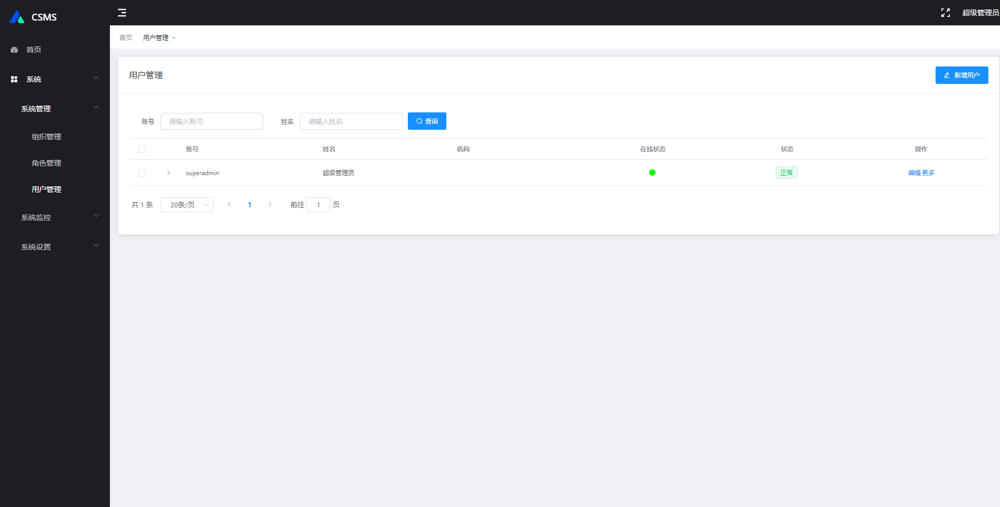

# SuBoot
构建企业级全生态体系




# 项目介绍
基本Spring boot 开发

# 环境要求
* 必须JDK8+
* IDEA IDE开发工具,可选

# 使用mvn命令
```
# 启动项目
mvn compile spring-boot:run

# 项目打包
mvn clean package

# 项目打包跳过测试环节
mvn clean package -Dmaven.test.skip=true
```

# 项目部署
```
# 直接运行
java -jar xxx.jar

# 若需要设置jvm内存大小等参数:
java -Xmx512m -Xms512m -jar xxx.jar

# 多环境加载问题
java -jar xxx.jar --spring.profiles.actvie=dev 

# Linux 后台运行
nohup  java -Xmx512m -Xms512m -jar xxx.jar >nohup.log&

```


# 软件框架
| 名称         | 技术       |
|------------|----------|
| SpringBoot | 容器+MVC框架 |
| Lombok     | 简化对象封装工具 |
| Hutool     | Java工具类库 |
| Druid      | 数据库连接池   |
| logback    | 日志组件     |

# 问题处理

| 标题           | 问题                               | 解决方案                                                                     | 状态  |
|--------------|----------------------------------|--------------------------------------------------------------------------|-----|
| 打包发布上线       | 如何打包发布上线                         | 使用maven打包                                                                | √   |
| 输出日志信息       | 如何输出日志方便排查异常问题                   | 集成logback,解决程序日志输出问题                                                     | √   |
| 日志输出banner图形 | 如何在日志输出banner图形                  | 在resources目录中,新增banner.txt。并在SpringApplication开启LOG模式                    | √   |
| 配置数据源        | 如何配置数据源                          | 整合Druid数据源,数据源的主要用途,是提供一个统一的获取数据库连接的方式.以及配合官方文档自定义实现Druid的功能,如监控页、登录、统计等 | √   |
| 配置文件明文密码加密处理 | 如何对application.yml配置文件明文密码进行加密处理 | 整合Jasypt,解决配置文件明文密码加密处理                                                  | √   |
| 统一请求返回格式     | 如何设定数据统一返回格式                     | 统一数据返回格式JSON                                                             | √   |
| 建立统一请求状态码    | 如何建立统一请求状态码                      | 建立统一状态码枚举类方便维护                                                           | √   |
| 定时任务         | 如何建立动态定时任务                       | 整合Quartz 是个开源的作业调度框架                                                     | √   |
| 权限体系         | 系统采用典型的 RBAC模型                   | 即 用户-角色-权限                                                               | √   |
| 异常处理         | 如何全局异常处理                         | 通过GlobalException全局异常处理器                                                 | √   |

